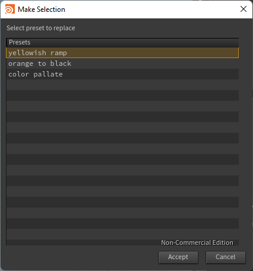
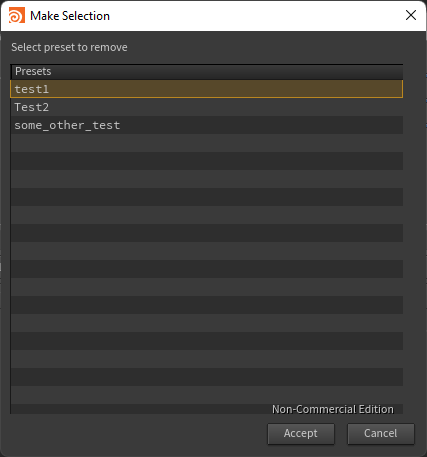
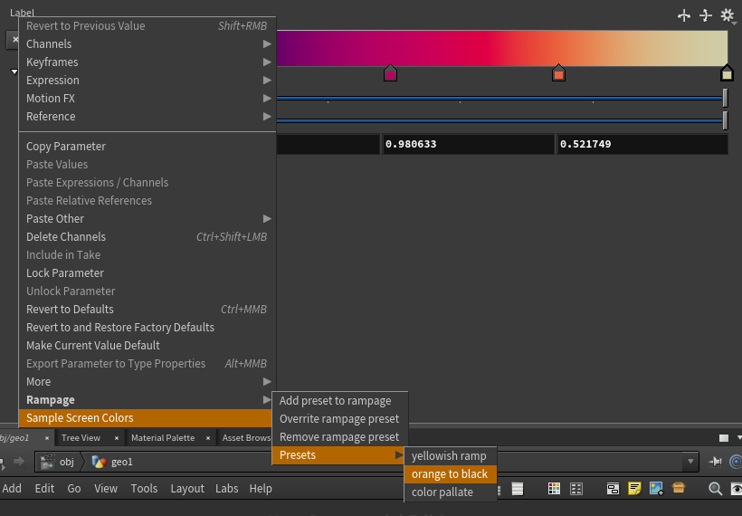

# Rampage

## Goals:
Rampage is utility for __Sidefx Houdini__ meant to help with managing user made presets for ramp
parameters. Houdini have some build in preset for ramps:

However editing this list by user is quite hard. Menu can be edited by adding package/user directory one file called __float.ramp__ or __color.ramp__. Those files have syntax similar to json but to see any changes restart of Houdini is required. The goal of __Rampage__ is to simplify this process by providing simple way of creating and managing preset for ramp parameters.

Both __color__ and __float__ ramps are supported.

## Rampage menu:
All functionality can be found in rampage menu:

### Add preset to rampage:
Simply ask for name of presets and let choose name. Name have to be unique!

### Replace rampage preset:
Shows list of existing presets and let choose which one should be replaced:

### Remove rampage preset:
Show list of existing presets and let choose which one should be removed:

### Presets submenu:
Let you choose from list of existing presets for given type of ramp.

## Implementations details:
### Package file
__Rampage__ is implemented with [Houdini packages](https://www.sidefx.com/docs/houdini/ref/plugins.html) in mind. That allow ease of installation and defining variables.
Variables defined by __Rampage__:
- _$RAMPAGE_PATH_ : path to rampage directory
- _$RAMPAGE_PRESETS_PATH_ : path to directory that contains presets
### Preset files
Presets are stored in _%RAMPAGE_PRESETS_PATH_ as json files. __color.json__ for color ramp and __float.json__ for float ramp. Currently there is no way to concatenate preset files in multiple locations.
## Requirements
__Houdini__ - __Python 3__ version(most of functions is typed)
## Contributors
- Paweł Bernaciak